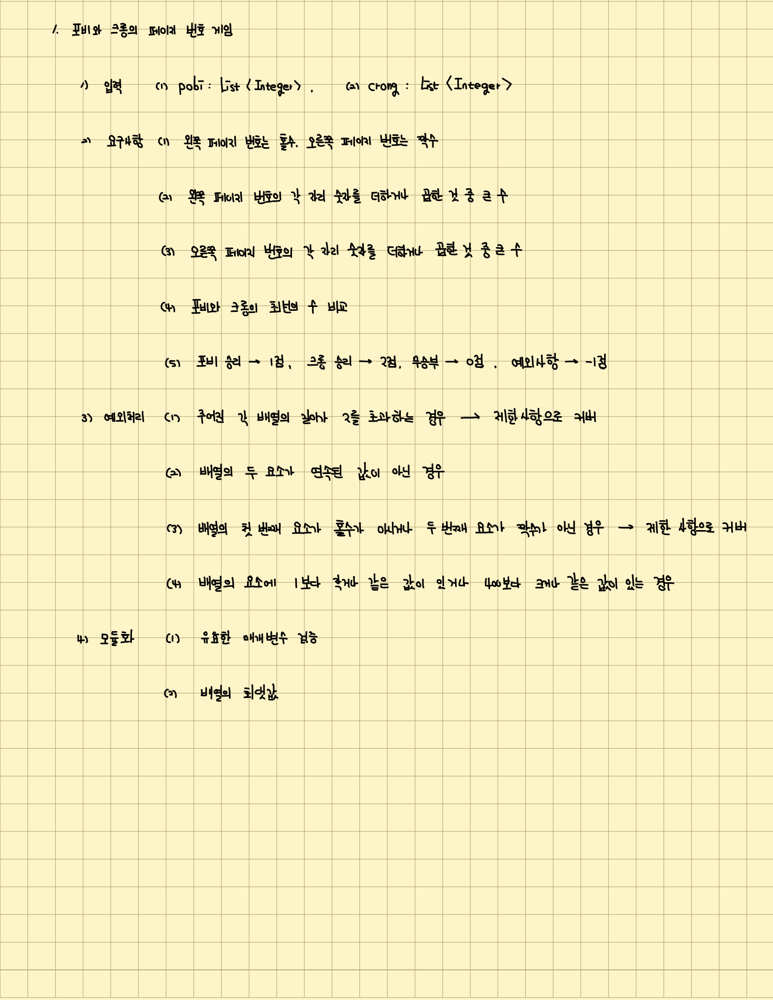
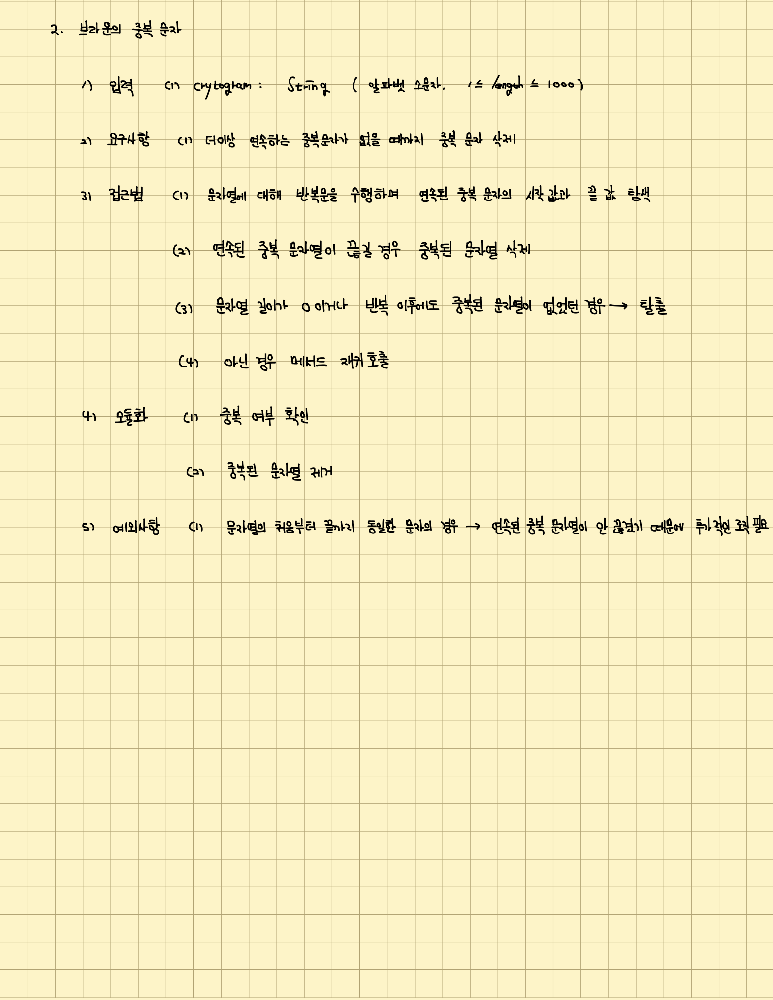
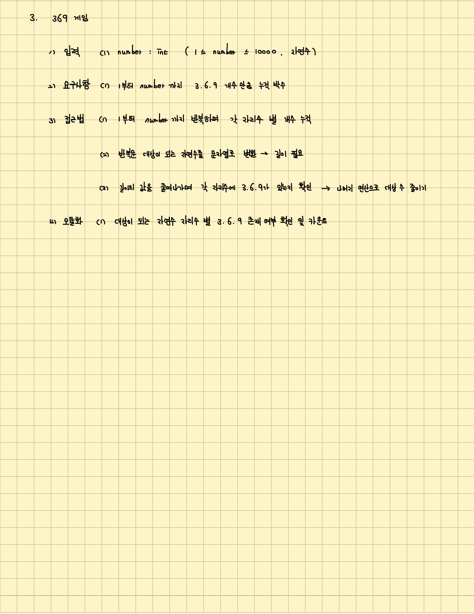
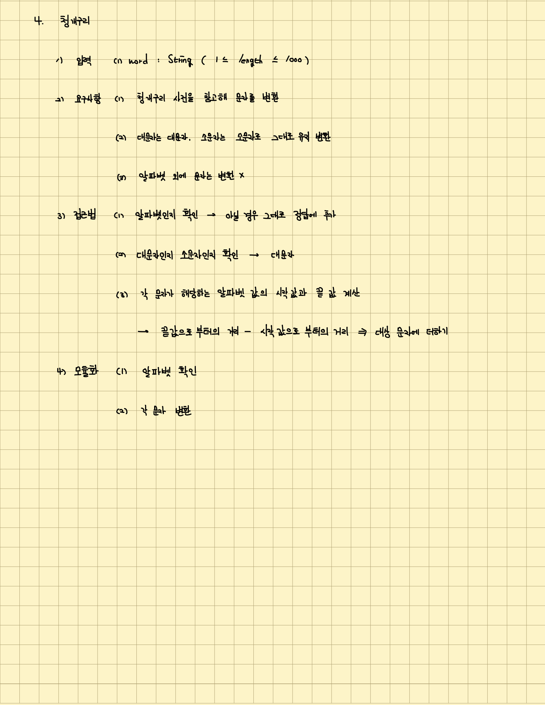
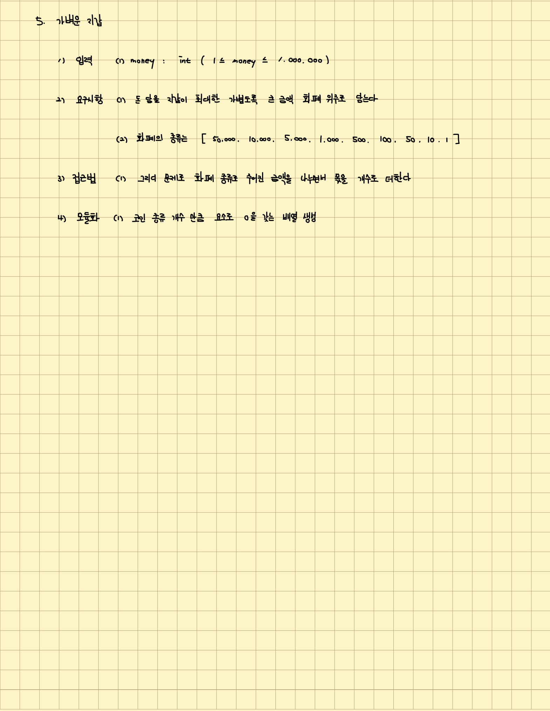
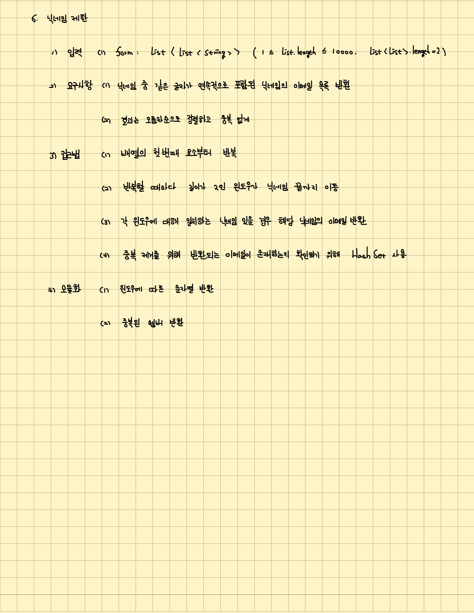
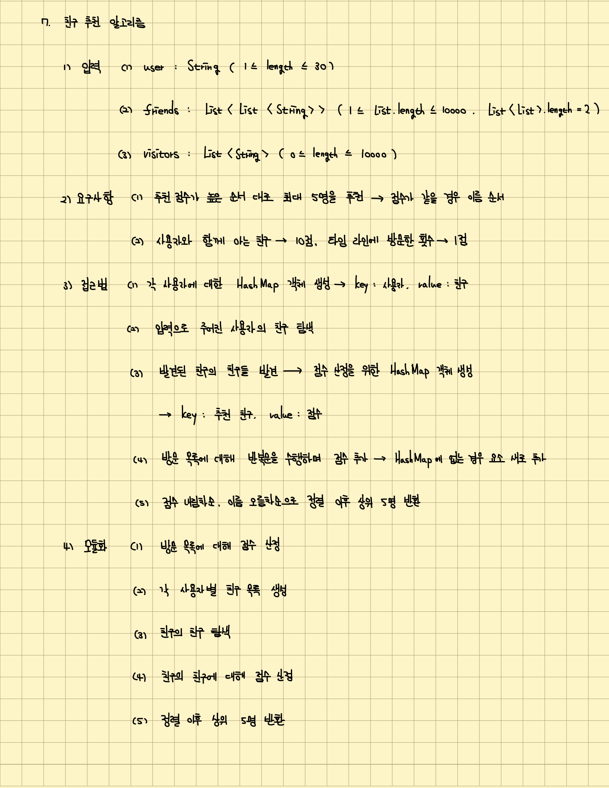

# 우아한 테크 코스 5기 프리코스 1주차를 마치며

## 목차

- [도입](#도입)
- [문제](#문제)
  - [문제 1](#문제-1)
  - [문제 2](#문제-2)
  - [문제 3](#문제-3)
  - [문제 4](#문제-4)
  - [문제 5](#문제-5)
  - [문제 6](#문제-6)
  - [문제 7](#문제-7)
- [느낀점](#느낀점)
  - [좋았던 점](#좋았던-점)
  - [아쉬운 점](#아쉬운-점)
- [결론](#결론)

## 도입

이번에 우아한 테크 코스 5기에 지원했다. 이번 기수는 이전 기수와는 다르게 지원한 사람 모두에게 프리코스를 경험할 수 있게 해주었는데 저번 수요일부터 시작하여 오늘(2022년 11월 01일 화요일)까지 해서 1주차를 진행했다. 7가지 알고리즘 문제를 푸는 게 이번 주차의 과제였는데 구현해야 할 기능을 목록화하고 클린 코드를 지향할 방법에 대해 고민하는 과정이 무척 뜻깊었다.

파이썬이 아닌 자바를 써본 게 거의 처음과 다름 없어 메서드 사용 방법은 물론 특히 동적 언어인 파이썬과 달리 자바는 정적 언어이기에 자료형을 선언하고 이를 사용하는데 있어 애를 먹었다. 자바와 익숙해지는 게 우선은 최우선 과제이고 다음으로 클린 코드와 객체지향 등에 대해 책을 읽으며 고민해봐야겠다는 생각이 들었다.

어쨌든 1주차를 진행하며 느꼈던 바를 남기고 싶어 이렇게 글을 적었다.

## 문제

각 문제에 대해 입력, 요구사항, 접근법, 예외처리, 그리고 모듈화 방법 등을 정리하여 먼저 노트에 기록한 뒤 구현에 들어갔다. 이런 절차를 통해 얻게 된 것은 단순히 기능이 작동할 수 있게 구현하는 걸 넘어서 놓치고 있는 예외처리는 없는지, 입력과 요구사항에 맞춰 어떻게 접근해서 풀 수 있는지, 그리고 이렇게 세분화된 접근법을 통해 모듈화 등 클린 코드를 지향할 수 있는 방법이 있는지에 대해 고민할 수 있어 좋았다.

### 문제 1

첫 번째 문제에서 가장 많이 고민한 부분은 예외처리 부분이다. 기능이 작동하게 구현하는 건 어렵지 않게 바로 떠올랐는데 시작과 끝 페이지를 펴면 안 된다는 점부터 요소의 크기에 대한 부분 등 여러 예외처리 요건 등을 고민하는 게 시간이 꽤 걸렸다. 한 번 노트에 정리를 하니 어떤 부분은 문제의 제한사항을 통해 해결할 수 있고 어떤 부분은 따로 메서드를 통해 예외처리를 해줘야 하는지 파악할 수 있어 좋았다. 특히 각 요소의 최댓값을 구하는 과정에서 최댓값 구하는 로직 자체가 입력값의 두 배열에 중복으로 수행되어야 하는 점을 통해 해당 메서드를 모듈화하여 클린 코드를 지향하려 노력했는데 이때의 고민과 사고가 나머지 문제에서도 클린 코드를 어떻게 지향할 수 있을지 고민하게 도와줬다.

### 문제 2

처음에 문제의 요구사항을 잘못 받아들여 바로 문제를 풀었다가 이후 수정했다. 이러한 실수를 다시 안 하기 위해 문제 2번을 푼 이후에는 노트를 무조건적으로 우선하는 걸 원칙으로 삼았다.

실수한 부분은 연속으로 중복된 문자열의 길이가 2보다 클 수 있다는 점이었는데 예를 들어 `abbbc`와 같이 입력값이 주어질 경우 연속된 문자열 `bbb`의 길이는 2보다 큰데 해당 문자열 전체를 삭제시켜야 한다. 처음에는 입력값에 두 개가 연속된 경우 밖에 존재하지 않아 반복문을 수행하며 현재의 요소와 다음 요소를 비교해서 동일할 경우 삭제하는 방식으로 문제를 풀었는데 길이가 2보다 클 경우를 고민하니 윈도우(Window) 크기를 계산해서 해결할 수 있을 것 같았다. 그래서 중복되는 경우에 대해 윈도우 크기를 계속 늘려나간 뒤 그 연속이 끝난 경우에 대해 중복을 제거하는 방식으로 로직을 구현하였고 이러한 과정을 문자열의 길이가 0이 되거나 모든 문자에 대해 검사를 했는데 중복된 문자가 없을 경우까지 수행해야 하기 때문에 조건을 나누어 메서드를 재귀적으로 호출하게 구현했다. 이때 유의할 점은 문자열의 처음부터 끝까지 동일한 문자열일 경우 연속된 문자가 끊긴 적이 없기 때문에 반복문 내에서는 삭제가 안 되어 반복문이 끝난 뒤에 해당 사항에 대해 예외적으로 중복 제거 작업을 수행하였다.

노트를 통해 놓쳤던 부분은 물론 예외 사항과 재귀함수의 종료 등에 대해 확실하게 알 수 있어서 좋았다.

### 문제 3

나눗셈 연산과 나머지 연산을 통해 답을 구할 수 있는 문제였다. 3, 6, 9라는 숫자가 포함되어 있는지 여부를 확인할 때 3, 6, 9라는 숫자를 개별적으로 조건문 내에 OR(`||`) 연산을 통해 확인하게 하였는데 추후 확장성을 고민할 때 해당 부분을 배열로 변환한 뒤 배열 내에 비교하려는 숫자가 존재하는지 `contains` 메서드를 통해서 확인하는 게 좋을 것 같다는 생각이 들어 바꾸었다.

### 문제 4

해시맵(`HashMap`)을 활용하여 변환해야 할 문자에 대해 쌍(Pair)을 만들 생각을 했었는데 알파벳 소문자와 대문자에 대해서만 변환을 해주면 되기 때문에 아스키 코드 값을 토대로 바꾸는 로직으로 접근법을 생각했다.

한 가지 아쉬운 점은 소문자, 대문자, 그리고 기타 다른 문자에 대해 조건이 분기가 되어 로직이 구현되어야 하는데 이 부분에 대한 조건을 아스키 값의 범위를 통해 진행했었다. 아스키 값의 범위를 통한 비교 자체가 조금은 복잡한 구현으로 느껴지기도 했고 `else if` 예약어까지 사용해야 하는 상황이 클린 코드를 지향하지 못했다는 생각이 들어 아쉬웠다. 관련해서는 크루 분들과의 코드 리뷰 등을 통해 어떻게 변경하면 좋을지 조언을 얻어보고 싶다.

### 문제 5

처음에 화폐의 단위 개수 만큼 배열을 생성하고 이에 대해 개수를 추가하는 로직을 모듈화하려 했는데 따로 확장성을 고민하지 않아도 괜찮을 것 같아서 그대로 한 클래스 내에 포함시켰다. 화폐의 단위가 되는 배열 객체와 각 화폐 단위별 개수만 세면 되는 로직이기 때문에 하나의 메서드가 하나의 작동만 추구한다고 생각되었기 때문이다. 이 부분도 다른 분들에게 조언을 구해 조금 더 확장성을 생각할 부분이 존재했는지 어떻게 하면 클린 코드를 추구할 수 있었을지 조언을 얻어보고 싶다.

### 문제 6

효율적인 구현, 다시 말해 복잡도를 생각한 구현에 있어 어려움을 느낀 문제였다. 처음 생각한 로직은 일종의 부르트 포스(Brute Force) 로직으로 세 번 중첩된 반복문을 수행해야 하는 로직이었는데 다른 여러 접근법을 떠올리다가 마땅히 떠올리지 않아 그대로 그 방법을 사용했다.

중복된 단어가 존재하는지 여부는 문자열의 길이를 2로만 고정시켜 다른 닉네임에 대해 `contains` 메서드를 활용해 조사하면 되기 때문에 윈도우 크기를 2로 고정시켜 반복문을 수행했다. 이때 중복된 단어가 존재하는지 확인하는 메서드, 고정된 윈도우 크기의 문자열을 만드는 메서드, 중복된 멤버를 반환하는 메서드를 모듈화해서 각각의 메서드로 구현해 클린 코드를 지향하려 노력했다.

조건문 자체에서도 직접 메서드를 사용하기 보다 캡슐화를 통해 메서드를 만들어 사용하는 게 좋다는 이야기를 들었었는데 관련해서 상황 별로 어떻게 다르게 적용시킬 수 있을지에 대해서는 이후 코드 리뷰 등을 통해 조언을 구해봐야 할 것 같다. 추가로 클린 코드를 지향하는 방법 외에도 어떤 더 효율적인 알고리즘 접근법이 있었을지 알고 싶었다.

### 문제 7

구현 자체는 기능이 많아야 해서 복잡했지만 목록화가 무척 큰 도움이 되어 그리 어렵지는 않았다. 문제는 객체지향적이라기 보다는 절차지향적인 방식으로 문제를 해결하게 된 것 같은데 메서드 별로 `return`문이 존재하고 이에 대해 해시맵 값을 지속적으로 업데이트 해야하다 보니 친구의 친구인 경우와 방문자인 경우에 대해 점수를 책정할 때 순서가 생겼다. 친구의 친구인 경우를 우선적으로 수행한 뒤에 방문자인 경우를 수행하게 한 것이다. 해당 부분에 있어 절차적인 게 어쩔 수 없었다는 생각이 들면서도 조금 더 확장성 있는 구현 방법이 존재했을 것 같은 아쉬움이 남아 다른 사람에게 조언을 구해보고 싶다.

추가적으로 해시맵을 정렬할 때 정렬 조건이 복수개였기 때문에 이를 해결하기 위해 여러 메서드를 꼬리 물기 형식으로 불러오게 되었는데 <객체지향 생활체조 원칙>이라는 글을 통해 한 줄에 점을 하나씩 찍는다는 걸 알게 되어 해당 코드를 조금 수정하였다. 문제는 정렬에 있어 관련된 구현이 조금은 복잡하게 느껴질 수도 있을 것 같아 더 깔끔하게 구현하는 방법에 대해 조언을 얻고 싶다.

## 느낀점

### 좋았던 점

세부적인 기능 목록화, 클린 코드 지향, 협업 고려를 통해 단순히 코드를 써내려가는 것이 아닌 어떻게 하면 함께 효율적으로 일할 수 있을지, 변해가고 발전시켜야 하는 소프트웨어를 어떻게 하면 잘 관리할 수 있을지에 대한 고민으로 이어져 좋았다.

### 아쉬운 점

앞서 이야기했던 것처럼 파이썬과 자바의 언어적 차이 때문에 구현에 시간이 많이 걸린 게 여러모로 아쉬웠다. 더욱이 자바 내장 메서드와 JUnit 같은 테스트를 위한 외부 라이브러리의 작동 방식 등을 잘 알고 있지 못해 더 아쉬웠다. 또한 클린 코드를 지향한다고 노력했지만 클린 코드 및 객체지향 원칙 등에 대해 자세히 잘 모르고 있기 때문에 확신을 가지고 기능을 구현하지 못해 아쉬웠다. 끝으로 깃이 스냅샷과 가비지 컬렉터(Garbage Collector, GC)를 통해 다른 분산 버전 관리 시스템을 이기고 가장 많이 사용한 오픈 소스 프로젝트가 되었는다는 사실을 공식 문서 등을 공부하며 알게 되었는데 관련해서 다른 참여자들에게 지식을 공유해주지 못해 아쉬웠다.

## 결론

여러 모로 기간 내에 노력하는 것만으로도 많은 걸 생각해볼 수 있는 시간이었다. 하지만 더 잘 해보고 싶은 욕심이 있기에 다른 참여자와 함께 코드 리뷰도 진행하고 내가 학습한 내용도 공유하는 시간을 꼭 가져야겠다. 2주차 때부터는 본격적으로 자바 자체에 대한 학습과 더불어 <클린 코드>, <객체지향의 사실과 오해> 등과 같은 책을 통한 클린 코드 및 객체지향 원칙 학습에 집중하며 어떻게 하면 주어진 요구사항과 예외사항을 고려해서 기능을 구현하는 과정에서도 클린 코드와 객체지향 원칙을 지향할 수 있을지에 대해 이론적으로 확신을 갖고 접근해봐야겠다.
