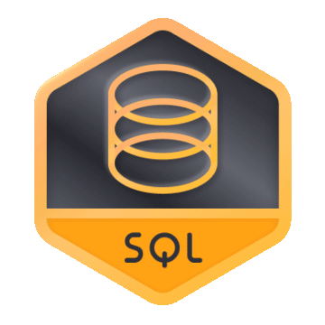
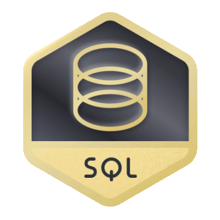
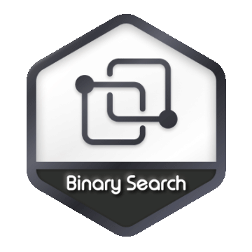
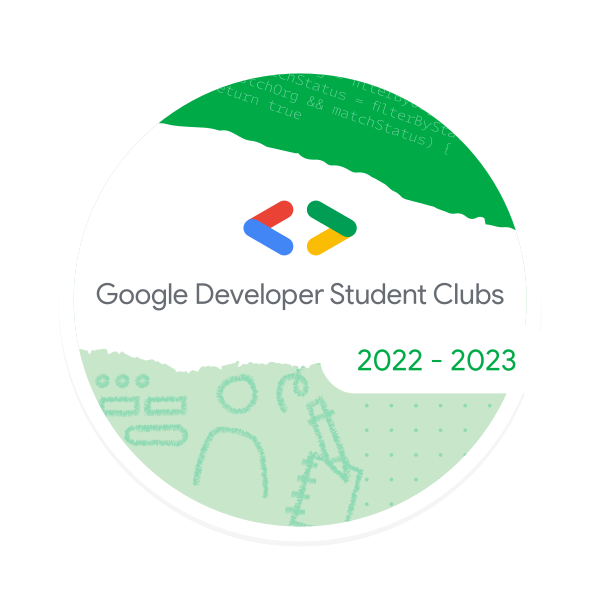
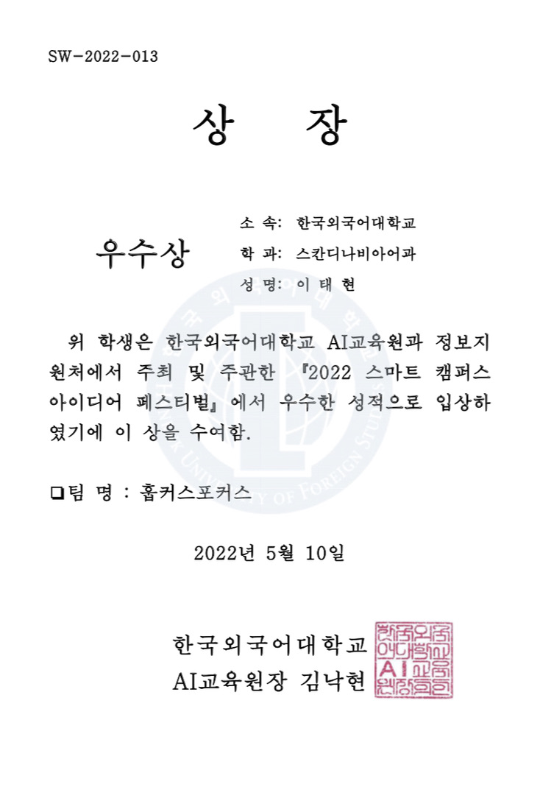
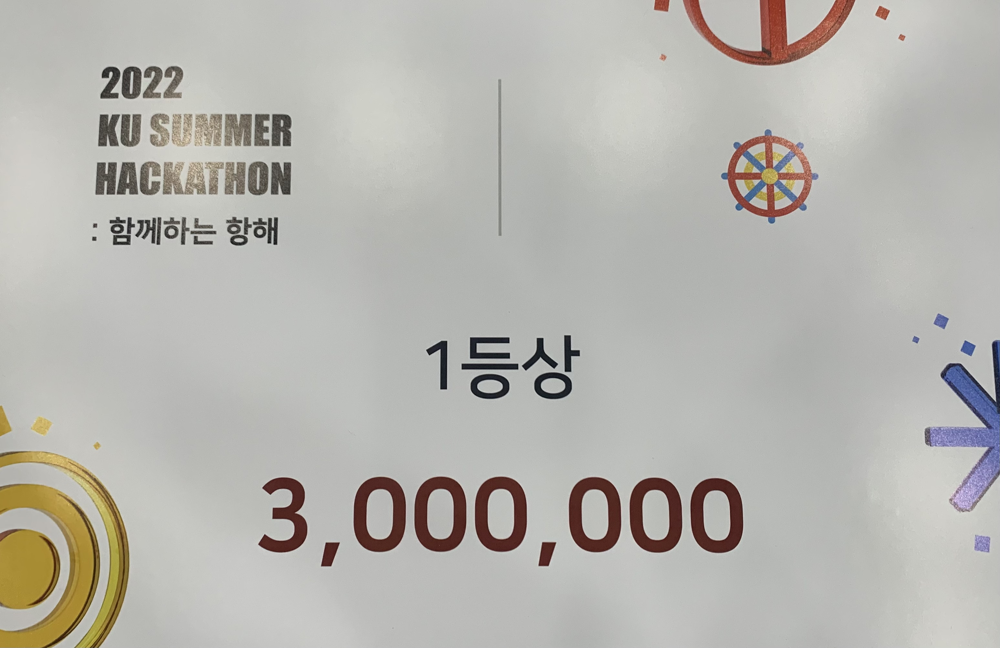
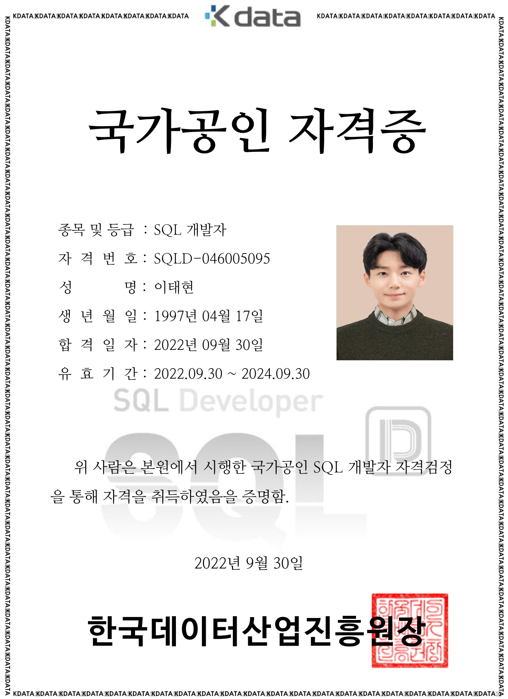

### LeetCode

#### List of Accomplishments

1. **SQL I** Study Plan
2. **SQL II** Study Plan
3. **SQL III** Study Plan
4. **Binary Search I** Study Plan

  
  
  
  

### Google

#### List of Accomplishments

1. Google Developer Student Clubs Core Member 2022 - 2023

  

## Awards

### Hankuk University of Foreign Studies (HUFS)

#### List of Awards

1. 2022 Smart Campus Idea Festival 3rd Place
2. 2022 HUFSummer Hackathon 1st Place

  
  

### Korea University

#### List of Awards

1. 2022 KU Summer Hackathon 1st Place

  

### Google Developer Groups Campus Korea (GDG Campus Korea)

#### List of Awards

1. 2022 Summer Hackathon 3rd Place

  

## Certificates

### 2022

#### SQLD

  

