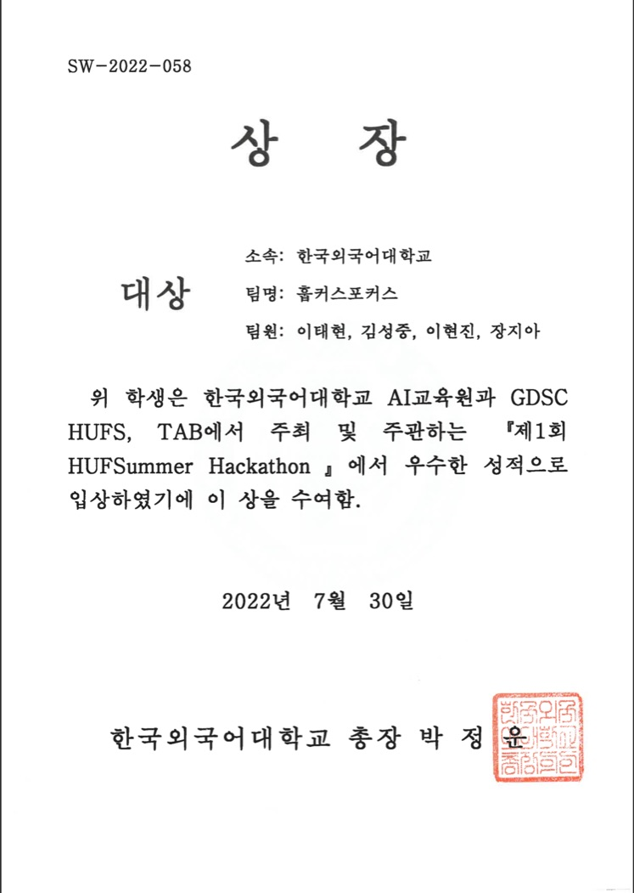
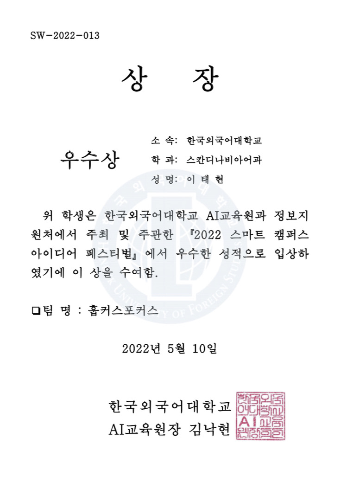
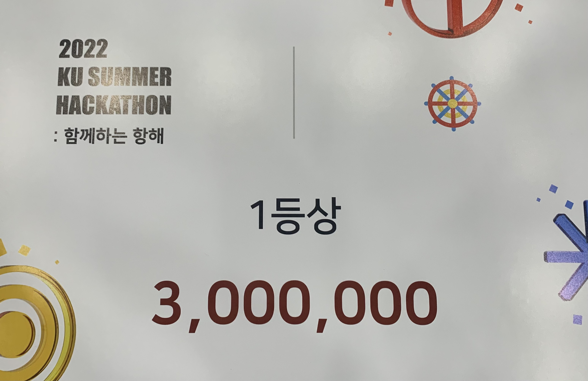
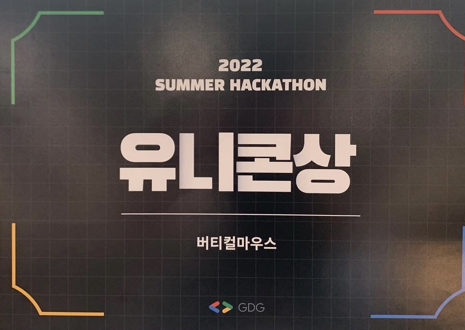

## Accomplishments

### LeetCode

<article>
    <figure markdown>
        { width="100" }
        <figcaption> SQL I Study Plan </figcaption>
    </figure>
    <figure markdown>
        { width="100" }
        <figcaption> SQL II Study Plan </figcaption>
    </figure>
    <figure markdown>
        { width="100" }
        <figcaption> SQL III Study Plan </figcaption>
    </figure>
    <figure markdown>
        { width="100" }
        <figcaption> Binary Search I Study Plan </figcaption>
    </figure>

</article>

### Google

<figure markdown>
    { width="200" }
    <figcaption> Google Developer Student Clubs Core Member 2022 - 2023 </figcaption>
</figure>

## Awards

### Hankuk University of Foreign Studies (HUFS)

<article>
    <figure markdown>
        { width="350", height="500" }
        <figcaption> 2022 Smart Campus Idea Festival 3rd Place </figcaption>
    </figure>
    <figure markdown>
        { width="350", height="500" }
        <figcaption> 2022 HUFSummer Hackathon 1st Place </figcaption>
    </figure>

</article>

### Korea University

<figure markdown>
    
    <figcaption> 2022 KU Summer Hackathon 1st Place </figcaption>
</figure>

### Google Developer Groups Campus Korea (GDG Campus Korea)

<figure markdown>
    { width="500" }
    <figcaption> 2022 Summer Hackathon 3rd Place </figcaption>
</figure>

## Certificates

### 2022

<figure markdown>
    { width="500" }
    <figcaption> SQLD </figcaption>
</figure>
